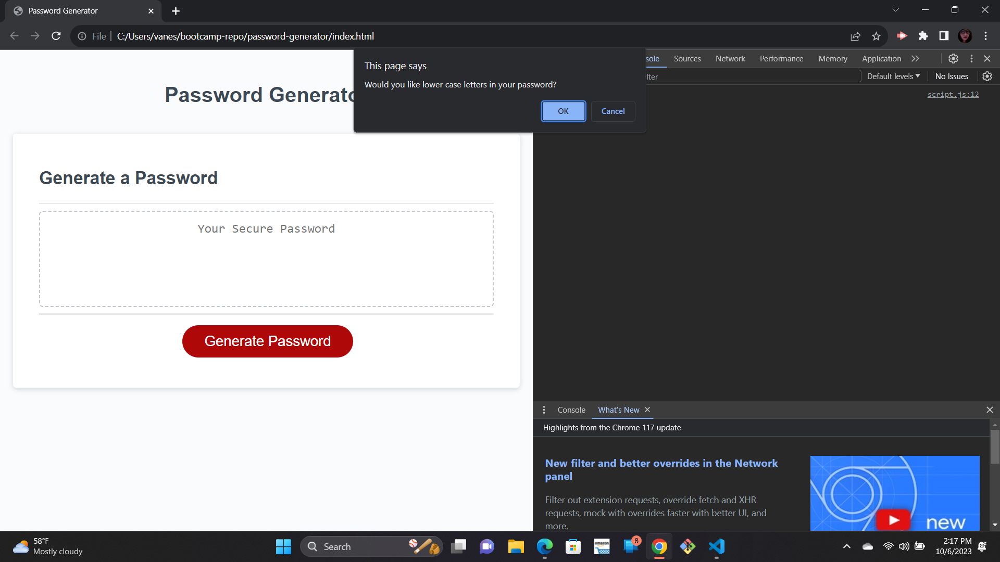
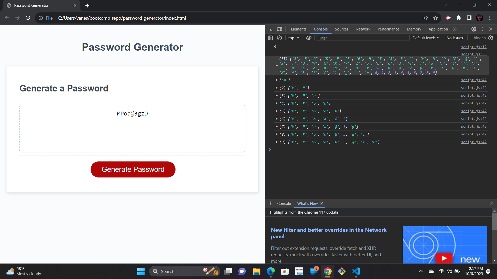

# Password Generator

## Decription

Using started code, the objective of the task was to create a password generator that prompted it's users to chose special qualifications for their password. I learned how the many different small peices of code work together to create a functioning application.

GIVEN I need a new, secure password
WHEN I click the button to generate a password
THEN I am presented with a series of prompts for password criteria
WHEN prompted for password criteria
THEN I select which criteria to include in the password
WHEN prompted for the length of the password
THEN I choose a length of at least 8 characters and no more than 128 characters
WHEN asked for character types to include in the password
THEN I confirm whether or not to include lowercase, uppercase, numeric, and/or special characters
WHEN I answer each prompt
THEN my input should be validated and at least one character type should be selected
WHEN all prompts are answered
THEN a password is generated that matches the selected criteria
WHEN the password is generated
THEN the password is either displayed in an alert or written to the page

## Installation
N/A

## Usage

When on the landing page of the application, click the red button "generate password". A prompt will open at the top of the page, asking you to choose the length in numbers, you would like to use to create your password. If the number is less than 8 or greater than 128, it will send a prompt stating to repick a number within those peramitors. If a corrisponding number is chosen, it then prompts you through whether or not you would like to use upper case, lower case, symbols, and numbers in you password. A password with your chosen peramiters is displayed on the screen when completed.

You can review the code in devtools by right clicking and selecting 'Inspect'. Select "console" once the inspect window is open to the side, to see console.log values. 

## Credits
N/A

## License
Please refer to the license in the repo.